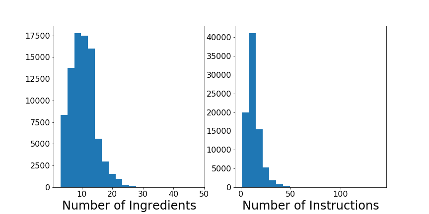
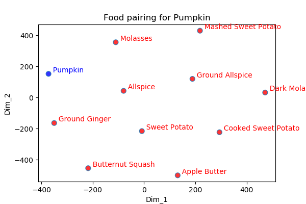
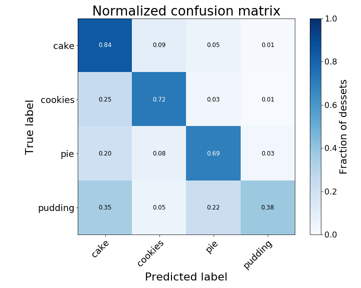
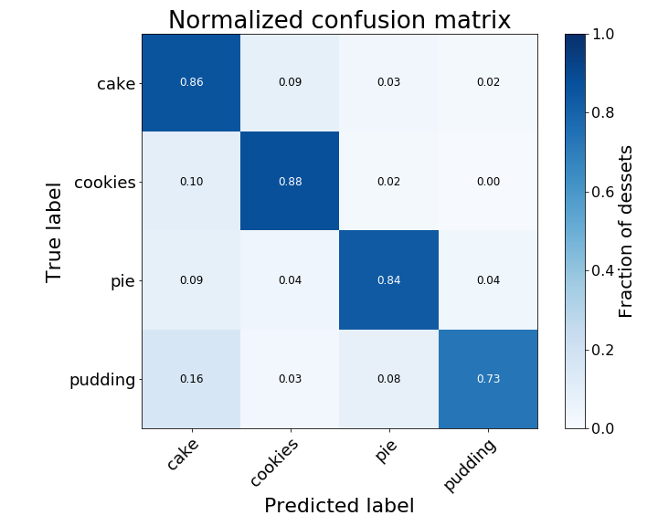

# Leave room for dessert!
Angel Manzur, PhD


## Goal
The goal of this project is to analyze over 84k dessert recipes found online in order to:
  - find unique flavor combinations
  - tell the user what type of dessert to make, given a certain number of ingredients
  - find an excuse to try new desserts

## Data
Certainly there are millions of dessert recipes out there - a simple Google search of 'dessert recipes' returns about 726 million results! Instead of spending the next few weeks (or months!) scraping different recipe websites in search of the ultimate recipe, we can use the data collected by [Marin et al.][1] for their project *Recipe1M+:  A Dataset for Learning Cross-Modal Embeddings for Cooking Recipes and Food Images* published in the IEEE Tansactions on Pattern Analysis and Machine Intelligence. 

The datasets, which can be accessed [here](http://im2recipe.csail.mit.edu/), consist of over 1 million recipes with 13 million associated images. For this project, I will only focus on the text recipes. The data is stored in two json files: 
  - layer1.json file, (1.3Gb) with 1,029,720 recipes. 
  - det_ingrs.json file (344 Mb) with the extracted ingredients for each recipe in the layer1.json file.
  
 Each recipe in the layer1.json file is a dictionary with the following information: 

   | Key | Description |
   |:---:|:---:|
   |ingredients| A list of all the ingredients needed |
   | url | The url where the recipe was scraped |
   | title | The title of the dish |
   | id | Unique id given to the recipe |
   | instructions | List of instructions to make the dish |
    
  Below is an example of one of the recipes
    
   | Key | Data |
   |:---:|:---:|
   |ingredients| 1 whole Vanilla Wafer Cookie, 1- 1/2 whole Peeled Bananas,'2 cups Coconut Milk, 2 Tablespoons Fat-free Half-and-half, 1 Tablespoon Vanilla Extract, 1/2 teaspoons Stevia (more To Taste), 1 cup Ice Cubes,4 Tablespoons Whipped Cream|
   | url | http://tastykitchen.com/recipes/drinks/banana-cream-pie-smoothie/ |
   |title | Banana Cream Pie Smoothie |
   | id | 00016355e6 |
   | instructions | Place vanilla wafer cookie in a baggie, seal bag and crush it into tiny pieces (I rolled a rolling pin over it). Set aside. In a blender add banana, coconut milk, half-and-half, vanilla extract, stevia and ice cubes. Put the lid on and blend until smooth. Pour into 2 cups and top each smoothie with whipped cream and crushed wafer cookie. |
   
The second file (det_ingrs.json) contains the ingredients extracted by [Marin et al.][1]. For each recipe, there is a dictionary with the keys `id`, and `ingredients`. The table below shows the values for the recipe  shown above:

  | Key | Data |
  |:---:|:---:|
  |id | 00016355e6 |
  |ingredients | vanilla wafer cookie, bananas, coconut milk, 'fat-free half-and-half, vanilla extract, stevia, ice cubes, whipped cream|

  
### Finding desserts (data cleaning)
As with any data science project, the first and most time consuming step is cleaning and preparing the data so we can create a model with it. For this project the first step is extracting the desserts from the dataset. According to [Marin et al.][1], 22% of the data are desserts. 

The first step is to identify desserts. For that, I look for "dessert keywords" in the recipe title. Some of these "dessert keywords" are
```python
dessert_keywords =    ['cookies','pie','crumble', 'cake', 'ice-cream','ice cream','praline','macaron',
                      'cheesecake','cupcake','waffle','pudding','truffle','toffee','tart','torte',
                      'zabiglione','trifle','toffee','sweets',  'sundae','strudel','shortcake','souffle',
                      'shortbread','sherbet','scone'"s'mores",'bread','popsicle','popover','brittle', ... ]
```                     
Selecting desserts this way results in about 23% of the recipes classified as desserts. However, there are some outliers; for example: ["Cornbread Turkey Taco Cheescake"](https://www.food.com/recipe/cornbread-turkey-taco-cheesecake-with-zesty-avocado-cream-398439). Is this an entree? A dessert? Mexican food? 
To further clean the data, I rejected files that had a non-dessert keyword in the title:
```python
non_dessert_keywords = ['soup','taco','salad','casserole','pasta','meatloaf','fish','seafood',
                        'risotto','stew','savory','savoury','stir-fry','corn bread','steak','pasta', ... ]
```
However, if watching all the seasons of "The Great British Bake Off" has taught me anything, it is that there are savory pies, and that cookies may be called biscuits. So, to further clean the data, I scanned through the ingredients in the recipe, looking for non-dessert ingredients. This step is a bit tricky as I want to keep unusual combinations, such as "kale chocolate chip cookies" or "bacon donuts"; however, I can't imagine any dessert containing fish. The final list of ingredients to reject is:
```python
not_dessert_ingrs = ['fish','salmon','tuna','chicken','turkey','garlic', 'onion','lamb',
    'sausage','shrimp','beef', 'taco','shallot','veal','pork','mincemeat','crab','filet',
    'chipotle', 'pancetta', 'asparagus','parsley','mushroom','sardines','olives','oyster','ham',
    'snow pea', 'kimchi','cilantro','Worcestershire','tomato paste', 'salsa','bologna']
```
After filtering the data, I ended up with 195,805 dessert recipes, which corresponds to ~19.1% of the data. 


Finally, to be able predict what type of dessert the recipe is trying to make, we split the the desserts into one of the following categories
```python
categories = ['cake', 'cookies', 'pie', 'pudding', 'other']
```
As a first attempt at classification, a dessert belongs to each category if the category name appears in the title; otherwise, it is classified as `other`.
To be able to predict the category, I reject the desserts labeled as `other`. After all the filters, our dessert data set consisted of 84,884 recipes, ~8.5% of the original dataset. The table and histograms below show some statistics on the number of ingredients and the number of recipes in the data set. 

| . | Average | minimum value | maximum value |
|:---:|:---:|:---:|:---:|
|Number of ingredients | 13 | 3 | 48 |
| Number of instructions | 10 | 1 | 139 |



I know you are wondering which recipe has 48 ingredients - it's a [wedding cake!](https://www.foodnetwork.com/recipes/rosella-ginger-pecan-torte-wedding-cake-recipe-recipe-2118340). There are so many ingredients because this dessert is a combination of 5 different recipes: a cake, a meringue, a marmalade, a cream, and a chocolate ganache.


## Running some model
### Flavor Matching
To find ingredients with a similar flavor profile, I trained a word 2 vector model. To do this we need to further clean the dataset, as flour, for one, is not a flavor. I applied another filter to the ingredient data set to label items that are needed in the recipe but do not add flavors to the dessert; for example: flour, food coloring, water, and baking soda. 

But we are not done yet, as some ingredients are referenced with different words; for example, confectioners sugar can also be referenced as icing sugar or powdered sugar, and vanilla extract may also be referenced as pure vanilla extract.  I applied several filters and renamed some ingredients with more generic names. For example, instant coffee, espresso coffee, and dark coffee were all replaced with coffee. 
 
While this works on the most common ingredients, there is plenty of work on this area, as several ingredients may have different names in different regions, some recipes refer to the ingredients by their brand, and several ingredients are misspelled. 

To train the model, we used the word2ve model from [gensim](https://radimrehurek.com/gensim/models/word2vec.html), and trained it on the recipe ingredients. For the model, each work was converted into a 50-dimension vector.  With the resulting model we are able to predict similar ingredients. The table below shows some of the results:

| Ingredient | Similar Ingredient |  Similar Ingredient | Similar Ingredient |
|:---: |:---: |:---: |:---: |
| pumpkin | sweet potato | butternut squash | allspice |
| rum | brandy | sherry wine | dark rum|
| almond | marzipan | amaretto | toasted almonds |

The model makes sense; however, it is not perfect. For example, almond is also similar to ground almond, sliced almond and blanched almond - so more cleaning is needed!

A different way of displaying the data is reducing the 50-dimension vectors into a 2 dimension vector using t-SNE and plotting the results. The plot below shows the top ten ingredients similar to pumpkin.



### Predicting a dessert type

Finally, let's see if we can predict which recipe you could make given a list of ingredients. To create a model there are different approaches we can take - testing different embedding techniques to vectorize the data (for example 50 vs 100 dimensions) as well as different classification models (Decision Trees, Random Forest, Neural Networks, etc)

In preparation for this project I tried two methods of embedding the data: first, training a word2vec model on the ingredients alone, and second, using a pre-trained [gloVe](https://nlp.stanford.edu/projects/glove/) to vectorize the words. The word2vec model used here is different than the one mentioned in the previous section as here we want to include all ingredients (like flour and sugar), rather than just flavors (like almond and pumpkin). 

As a base model I used a Random Forest on the word2vec data. As usual, the data was broken into train and test data sets, the train data was fitted using a Random Forest, and then the model was evaluated with the test data. The plot below shows the confusion matrix on the test data and the table below that shows the classification report created. The accuracy score for this model is 0.73.



| Category |  precision  |  recall | f1-score  | 
|:---:|:---:|:---:|:---:|
|           0   |    0.69 |    0.84  |    0.76 |   
|          1    |   0.78   |   0.72   |   0.75   |
|          2    |   0.74   |   0.69   |   0.71   | 
|           3   |    0.75  |    0.38   |   0.50 |

The results are better than expected, but can we do better? The next step was to test a Neural Network to see if we can improve. After reviewing tutorials and documentation for several neural networks, it is easy to see that we could fall into a rabbit hole given our many options. Instead of exploring multiple models, I decided to pick a RNN model as it has shown to be quite effective [2], and test different vectorization models.
### Word2Vec + Recurrent Neural Network
Using the same word embedding as with the previous model, but now we train a Recurrent Neural Network, obtaining an accuracy score of 0.85



 | Category |  precision  |  recall | f1-score  | 
|:---:|:---:|:---:|:---:|
| 0    |   0.85  |    0.86   |   0.85 |
|     1   |    0.85   |   0.88   |   0.86   | 
|     2   |    0.87   |   0.84   |   0.85   |   
|     3    |   0.81   |   0.73    |  0.77   | 
      
### gloVe + Recurrent Neural Network
Instead of using our trained word2vec model, I tested  embedding the words using the pre-trained [gloVe](https://nlp.stanford.edu/projects/glove/) vector of dimension 50. In this case we do a bit better with an accuracy score of 0.87. 


| Category |  precision  |  recall | f1-score  | 
|:---:|:---:|:---:|:---:|
|       0   |    0.85    |  0.90  |    0.87  | 
|      1   |    0.88   |   0.88  |    0.88   |  
|      2    |   0.90   |   0.84  |    0.87   |
|      3   |    0.84   |   0.76    |  0.80   | 
     
### Trainable Recurrent Neural Network, 
Finally, let's try not using any word embedding, and let the neural network train the word embedding. In this case the accuracy score was 0.86.


| Category |  precision  |  recall | f1-score  | 
|:---:|:---:|:---:|:---:|
|          0   |    0.88   |   0.86   |   0.87   | 
|     1   |    0.87   |   0.89   |   0.88  |   
|      2   |    0.84   |   0.88   |   0.86   |  
|      3   |    0.82   |   0.79   |   0.80   | 

## Summary
 - For this work we filtered +1 million recipes and extracted the ones for desserts only. Filtering was done based on the recipe titles and the ingredients. 
 - I created two word 2 vector models:
    - A flavor word 2 vec model for the flavor ingredients, where we removed ingredients that are needed but don't give any flavor, such as water, oils, and gelatin. We also merged different ingredients into generic ones; for example, sliced almonds, slivered almonds, and ground almonds would all be referred to as almonds. 
    - A word 2 vector model containing all the ingredients in the recipes.
 
 - With the flavor word2vec model I am able to find similar ingredients that complement each other.
 
 - With the word 2 vector model I am able to train a neural network to predict which type of dessert you could make. 
 
## Future work

 - Get a gym membership!
 - Get cooking/baking!
 - Continue cleaning the recipes, and find a better approach of classifing the desserts. For example, the recipes with more than 20 ingredients are usually desserts with multiple components, where each component is potentially a new recipe.
 - Improve the extraction of the ingredient quantities. One possible option is to train a neural network to extract the quantity and the unit for each ingredient. 
 - Incorporate the ingredient quantities into the model.


[1]: https://ieeexplore.ieee.org/document/8758197
[2]: https://arxiv.org/abs/1511.00215
